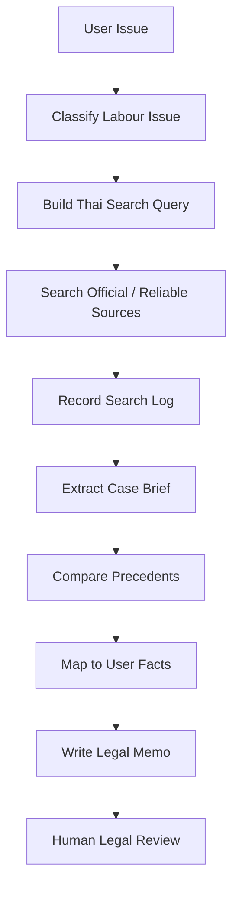

# Labour Dika Agent Skill Library

> GitHub-style Skill Library สำหรับ Agent ค้นหา วิเคราะห์ และสรุปแนวคำพิพากษาศาลฎีกา ประเภทคดีแรงงาน

## 1. Purpose
Repository นี้ออกแบบเป็นฐานความรู้และคู่มือปฏิบัติงานของ AI Agent สำหรับงานค้นหาแนวคำพิพากษาศาลฎีกาด้านแรงงาน โดยเน้นการทำงานแบบตรวจสอบย้อนกลับได้ มีหลักฐาน มี search log และมี human review ก่อนนำไปใช้ในงานกฎหมายหรือ HR Compliance ที่มีความเสี่ยงสูง

## 2. What this repo helps with
- สร้างคำค้นภาษาไทยสำหรับค้นคำพิพากษาศาลฎีกาคดีแรงงาน
- จัดหมวดหมู่ประเด็นแรงงาน เช่น เลิกจ้าง ค่าชดเชย OT วันหยุด วินัย ละทิ้งหน้าที่ แรงงานสัมพันธ์
- สรุปคำพิพากษาเป็น Case Brief
- เปรียบเทียบแนวคำพิพากษาหลายคดีเป็น Precedent Table
- เขียน Legal Memo / HR Compliance Memo
- แปลงหลักกฎหมายเป็นข้อเสนอแนะเชิง HR / Audit / Compliance

## 3. Repository Philosophy
Repository นี้ใช้แนวคิด 3 ชั้น:

1. `CONTEXT.md` = พื้นที่บอกบริบทแบบภาษามนุษย์
2. `AGENTS.md` = คู่มือคำสั่งปฏิบัติงานของ Agent
3. `CLAUDE.md` = วินัยการทำงานและ guardrails เพื่อลดการเดา / ลด hallucination

## 4. Recommended workflow



## 5. Folder map

```text
.
├── README.md
├── CONTEXT.md
├── AGENTS.md
├── CLAUDE.md
├── skills/
├── legal-register/
├── taxonomy/
├── prompts/
├── templates/
├── evidence/
├── outputs/
├── governance/
├── docs/
└── .github/workflows/
```

## 6. Minimum viable usage
1. เขียนข้อเท็จจริงของปัญหาใน `evidence/user_issue.md`
2. ใช้ `skills/skill_01_query_builder.md` เพื่อสร้างคำค้น
3. บันทึกผลค้นใน `templates/search_log_template.md`
4. สรุปแต่ละคดีด้วย `templates/case_brief_template.md`
5. เทียบแนวฎีกาด้วย `templates/precedent_table_template.md`
6. สรุปความเห็นด้วย `templates/legal_memo_template.md`
7. ตรวจทานด้วย `governance/human_review_checklist.md`

## 7. Important warning
Repo นี้เป็นเครื่องมือช่วยค้นคว้าและจัดระบบความคิด ไม่ใช่คำปรึกษากฎหมายขั้นสุดท้าย หากใช้กับการเลิกจ้าง การดำเนินคดี การลงโทษทางวินัย หรือข้อพิพาทที่มีความเสี่ยงสูง ต้องมีผู้เชี่ยวชาญกฎหมายตรวจทานก่อนใช้งานจริง
