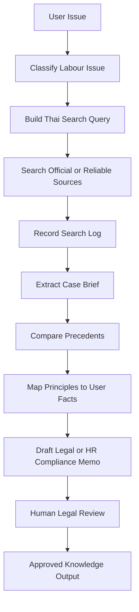

# Labour Dika Agent Skill Library

> A professional GitHub-style knowledge and governance library for AI-assisted research, analysis, comparison, and summarization of Thai Supreme Court labour-law precedents.

[](LICENSE)
[](#repository-classification)
[](#legal-and-risk-notice)
[](#language-and-terminology)

## Overview

Labour Dika Agent Skill Library is a structured knowledge repository and operating guide for AI agents that support Thai labour-law precedent research. It is designed for traceable, evidence-based work in which search terms, sources, extracted case facts, legal issues, holdings, comparisons, and human-review decisions can be audited later.

The repository supports legal research and HR/Labour Compliance workflows. It does **not** replace professional legal advice, judicial interpretation, or qualified human review.

## Repository classification

| Attribute | Value |
|---|---|
| Repository type | Legal / HR compliance knowledge repository |
| Primary use | Thai Supreme Court labour precedent research |
| Intended users | Legal researchers, HR professionals, auditors, compliance teams, trainers, and AI-agent developers |
| Risk level | High-risk professional knowledge support |
| Default review model | AI-assisted analysis with mandatory human legal review |
| License | MIT for original repository materials; third-party sources retain their own rights |
| Status | Active knowledge-library baseline |

## Core capabilities

- Build precise Thai-language search queries for labour-law judgments.
- Classify labour issues such as dismissal, severance pay, overtime, holidays, discipline, abandonment of duties, and labour relations.
- Record source provenance and search history.
- Extract judgments into structured case briefs.
- Compare multiple precedents through a precedent matrix.
- Map judicial principles to user-supplied facts.
- Draft Legal Memo and HR Compliance Memo working papers.
- Translate legal findings into HR, audit, governance, and control recommendations.
- Require human validation before high-risk use.

## Repository philosophy

The operating model uses three complementary control layers:

1. `CONTEXT.md` — human-readable domain context and boundaries.
2. `AGENTS.md` — operational instructions for AI agents.
3. `CLAUDE.md` — behavioural guardrails designed to reduce unsupported inference and hallucination.

These controls are supported by skills, templates, evidence records, governance documents, and reusable outputs.

## Recommended workflow


```mermaid
flowchart TD
    A[User Issue] --> B[Classify Labour Issue]
    B --> C[Build Thai Search Query]
    C --> D[Search Official or Reliable Sources]
    D --> E[Record Search Log]
    E --> F[Extract Case Brief]
    F --> G[Compare Precedents]
    G --> H[Map Principles to User Facts]
    H --> I[Draft Legal or HR Compliance Memo]
    I --> J[Human Legal Review]
    J --> K[Approved Knowledge Output]
```

## Repository structure

```text
.
├── README.md
├── LICENSE
├── CITATION.cff
├── BRAND.md
├── SECURITY.md
├── CONTRIBUTING.md
├── CODE_OF_CONDUCT.md
├── SUPPORT.md
├── CHANGELOG.md
├── CONTEXT.md
├── AGENTS.md
├── CLAUDE.md
├── skills/
├── legal-register/
├── taxonomy/
├── prompts/
├── templates/
├── evidence/
├── outputs/
├── governance/
├── docs/
└── .github/
    ├── CODEOWNERS
    ├── PULL_REQUEST_TEMPLATE.md
    └── ISSUE_TEMPLATE/
```

> The folder map is the intended professional information architecture. Contributors should not assume that every directory contains complete production-ready content.

## Minimum viable usage

1. Document the issue and material facts in `evidence/user_issue.md`.
2. Use `skills/skill_01_query_builder.md` to construct search terms.
3. Record searches and sources in `templates/search_log_template.md`.
4. Summarize each judgment with `templates/case_brief_template.md`.
5. Compare judgments with `templates/precedent_table_template.md`.
6. Draft the working conclusion with `templates/legal_memo_template.md`.
7. Complete `governance/human_review_checklist.md` before professional use.

## Evidence and citation standard

Every material legal proposition should identify, where available:

- court and judgment number;
- judgment date or publication date;
- legal issue;
- relevant facts;
- holding or principle;
- applicable statute, section, subordinate rule, or regulation;
- source URL or source-document reference;
- access date;
- analyst or agent responsible for extraction;
- human reviewer and review status.

Do not present an inferred proposition as a direct judicial holding. Clearly distinguish source text, paraphrase, analytical inference, and recommendation.

For repository-level academic or professional citation, use [CITATION.cff](CITATION.cff).

## Quality controls

A professional output should pass all of the following gates:

- source provenance recorded;
- duplicate or conflicting authorities checked;
- facts separated from legal conclusions;
- current statutory text verified where relevant;
- quotation length and copyright limits respected;
- personal and confidential data removed or minimized;
- unsupported claims identified;
- human legal review completed;
- final output marked with date and version.

## Security and privacy

Do not commit:

- personal identification data;
- employee records or medical data;
- confidential legal correspondence;
- production credentials or API keys;
- authentication tokens;
- private database exports;
- unredacted court documents containing sensitive personal information.

Use synthetic examples, placeholders, redaction, access controls, and `.env.example` patterns. See [SECURITY.md](SECURITY.md).

## Legal and risk notice

This repository is a research and knowledge-management tool. It is not a substitute for legal advice and must not be used as the sole basis for dismissal, disciplinary action, litigation strategy, settlement, regulatory reporting, or another high-impact employment decision.

Judgments are fact-specific. Statutory amendments, later judgments, procedural posture, jurisdiction, and evidentiary context may materially change the outcome. A qualified human reviewer must verify the law and the source material before use.

## Language and terminology

Thai is the primary working language for legal analysis. English technical terms may be retained for AI, governance, software engineering, audit, and knowledge-management concepts when they improve precision. Bilingual headings are encouraged where useful, but legal meaning must not be altered for stylistic consistency.

## Contribution model

Contributions are welcome for:

- new or improved skills;
- citation and source corrections;
- taxonomy improvements;
- templates and checklists;
- anonymized examples;
- governance enhancements;
- documentation fixes.

All contributions must follow [CONTRIBUTING.md](CONTRIBUTING.md), preserve source traceability, and avoid confidential or copyrighted reproduction.

## Maintenance and versioning

- Documentation changes use focused commits.
- Material skill changes should update the changelog.
- Breaking changes to file contracts, schemas, or workflows should be clearly documented.
- Historical legal statements must include a date or version context when necessary.
- Deprecated skills should be retained with a deprecation notice until migration guidance is available.

See [CHANGELOG.md](CHANGELOG.md).

## Governance documents

- [Brand and Attribution Standard](BRAND.md)
- [Citation Metadata](CITATION.cff)
- [Security Policy](SECURITY.md)
- [Contribution Guide](CONTRIBUTING.md)
- [Code of Conduct](CODE_OF_CONDUCT.md)
- [Support Policy](SUPPORT.md)
- [Changelog](CHANGELOG.md)

## Brand and attribution

Original repository materials are maintained by **Phumin Decoknoi (`PhuminDecOKnoi`)**. The MIT License permits reuse subject to its terms, including retention of the copyright and permission notice in copies or substantial portions.

Responsible reuse should identify material modifications, avoid false claims of authorship or endorsement, preserve legal-source traceability, and respect separate rights in third-party materials. See [BRAND.md](BRAND.md).

## Roadmap

- Expand the labour-law issue taxonomy.
- Standardize source-quality scoring.
- Add validation schemas for case briefs and precedent tables.
- Add automated Markdown quality checks.
- Add link and structure validation through GitHub Actions.
- Develop a versioned legal-register update workflow.
- Improve Thai legal citation examples and review checklists.

Roadmap items are planned directions, not implemented feature claims.

## License and third-party materials

Original repository materials are available under the [MIT License](LICENSE). Court judgments, statutes, publisher content, external articles, images, datasets, and third-party extracts may be governed by separate legal rights and are not relicensed merely because they are referenced in this repository.

## Maintainer

Maintained by **[Phumin Decoknoi (`PhuminDecOKnoi`)](https://github.com/PhuminDecOKnoi)**  
AI • Labour Law • HR Compliance • Audit • Knowledge Management
