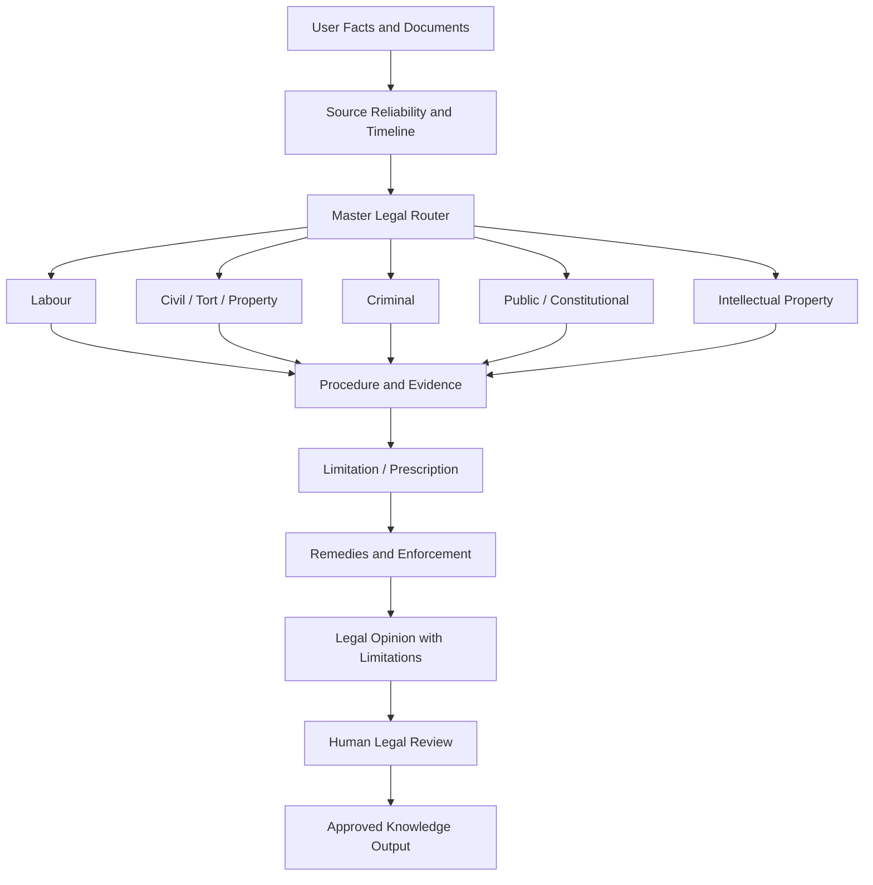

# Thai Legal AI Skill Library

> A professional GitHub-style knowledge, governance, and legal-reasoning library for AI-assisted analysis across Thai labour, civil, criminal, public, constitutional, intellectual-property, procedural, evidentiary, limitation, and compliance domains.

[](LICENSE)
[](#repository-classification)
[](#legal-and-risk-notice)
[](#language-and-terminology)
[](#maintenance-and-versioning)

## Overview

Thai Legal AI Skill Library is a structured knowledge repository and operating framework for AI agents that support Thai legal research, case analysis, HR and labour compliance, audit work, teaching, examination preparation, legal memoranda, and knowledge management.

The repository began with labour-law precedent research and now includes a multi-domain legal-routing layer. It is designed for traceable, evidence-based work in which facts, sources, applicable law, legal issues, elements, procedure, evidence, limitation, remedies, conclusions, and human-review decisions can be audited later.

This repository does **not** replace professional legal advice, judicial interpretation, or qualified human review.

## Repository classification

| Attribute | Value |
|---|---|
| Repository type | Multi-domain Thai legal knowledge and AI-governance repository |
| Primary use | Legal research, structured analysis, HR/Labour Compliance, audit, teaching, and legal knowledge management |
| Intended users | Legal researchers, law students, HR professionals, auditors, compliance teams, trainers, and AI-agent developers |
| Risk level | High-risk professional knowledge support |
| Default review model | AI-assisted analysis with mandatory human legal review |
| License | MIT for original repository materials; third-party sources retain their own rights |
| Current release line | Version 2.1 — Multi-Domain Legal Analysis |

## Legal-domain coverage

| Domain | Status | Typical analysis focus |
|---|---:|---|
| Labour law and labour relations | ✅ | Employment rights, dismissal, severance, wages, working time, discipline, labour relations |
| Civil and commercial law | ✅ | Rights, obligations, liability, contracts where relevant, remedies |
| Tort law | ✅ | Wrongful act, fault, causation, damage, defences, compensation |
| Property law | ✅ | Ownership, possession, real rights, interference, recovery and protection |
| Criminal law | ✅ | Elements, act, intent, participation, defences, multiplicity, punishment |
| Criminal procedure and evidence | ✅ | Jurisdiction, complaint, investigation, prosecution, proof, procedural status |
| Public law | ✅ | State power, authority, legality, public interest, accountability |
| Constitutional law | ✅ | Rights, equality, proportionality, separation of powers, constitutional review |
| Administrative-law issues | ✅ Related scope | Administrative power, procedure, review and remedy where connected |
| Intellectual property law | ✅ | Copyright, patents, trademarks, trade secrets, ownership, infringement, exceptions |
| Civil procedure and remedies | ✅ Related scope | Jurisdiction, burden, interim relief, judgment and enforcement |
| Special statutes | ✅ Context-dependent | Domain-specific rules, penalties, limitation and procedure |

## Core capabilities

- Route a legal problem to the correct primary, supporting, procedural, and special-law domains.
- Build precise Thai-language search queries for statutes, judgments, regulations, and official materials.
- Classify legal issues before selecting legal provisions.
- Record source provenance and search history.
- Identify the law in force on the relevant date.
- Quote and cite authoritative statutory text with section, paragraph, subsection, title, and effective date.
- Analyze legal elements against verified facts.
- Separate facts, allegations, source text, paraphrase, inference, recommendation, and conclusion.
- Analyze procedure, evidence, jurisdiction, burden of proof, limitation, remedies, and enforcement.
- Compare multiple judgments through case briefs and precedent matrices.
- Draft Legal Memo, HR Compliance Memo, case study, study note, and audit-ready working papers.
- Require human validation before high-risk use.

## Multi-domain legal architecture


```mermaid
flowchart TD
    A[User Facts and Documents] --> B[Source Reliability and Timeline]
    B --> C[Master Legal Router]
    C --> D1[Labour]
    C --> D2[Civil / Tort / Property]
    C --> D3[Criminal]
    C --> D4[Public / Constitutional]
    C --> D5[Intellectual Property]
    D1 --> E[Procedure and Evidence]
    D2 --> E
    D3 --> E
    D4 --> E
    D5 --> E
    E --> F[Limitation / Prescription]
    F --> G[Remedies and Enforcement]
    G --> H[Legal Opinion with Limitations]
    H --> I[Human Legal Review]
    I --> J[Approved Knowledge Output]
```

## Cross-domain examples

- Labour + Criminal: employee misconduct, fraud, document offences, violence, or unlawful disclosure.
- Labour + Civil/Tort: employer liability, workplace damage, reputation, personal injury, and compensation.
- Labour + Constitutional/Public Law: equality, state-employer authority, public-sector discipline, and proportionality.
- Labour + Intellectual Property: employee-created works, trade secrets, confidential information, and ownership.
- Civil + Criminal: one event creating both civil liability and criminal exposure.
- Property + Tort: possession or ownership combined with interference and damages.
- Public + Constitutional: authority, procedure, rights restriction, constitutionality, and judicial review.
- Intellectual Property + Criminal/Civil Procedure: infringement, seizure, interim relief, damages, and prosecution.

## Source hierarchy

```text
User instructions and task-specific documents
↓
Internal skills and verified knowledge files
↓
Current official statutory text applicable on the relevant date
↓
Subordinate legislation and official registers
↓
Court judgments and constitutional decisions
↓
Official interpretations and agency guidance
↓
Academic sources
↓
General web sources, corroborated and used cautiously
```

Core rule:

> Internal doctrine frames the analysis; current binding law controls; judicial decisions interpret and apply; secondary sources explain and critique.

## Legal-reasoning workflow

```text
Facts and source reliability
→ Timeline and date of legal effect
→ Primary and supporting legal domains
→ Jurisdiction and procedure
→ Applicable law and authoritative text
→ Elements, rights, duties, powers, and defences
→ Evidence and burden of proof
→ Limitation / prescription
→ Remedies, sanctions, and enforcement
→ Competing arguments and uncertainty
→ Conclusion and recommendations
→ Human legal review
```

## Repository philosophy

The operating model uses four complementary control layers:

1. `CONTEXT.md` — human-readable domain context and boundaries.
2. `AGENTS.md` — operational instructions for AI agents.
3. `CLAUDE.md` — behavioural guardrails designed to reduce unsupported inference and hallucination.
4. `skills/legal-multi-domain-analysis/SKILL.md` — cross-domain legal router and reasoning standard.

These controls are supported by domain skills, templates, evidence records, governance documents, and reusable outputs.

The repository also includes `skills/learning-outcome-study-summarizer/`, a reusable cross-subject study skill that aligns summaries to learning outcomes, source headings, activities, exercises, and answer keys while preserving source traceability.

## Repository structure

```text
.
├── README.md
├── LICENSE
├── CITATION.cff
├── BRAND.md
├── SECURITY.md
├── CONTRIBUTING.md
├── CODE_OF_CONDUCT.md
├── SUPPORT.md
├── CHANGELOG.md
├── CONTEXT.md
├── AGENTS.md
├── CLAUDE.md
├── skills/
│   ├── github-repository-professional-standard/
│   ├── learning-outcome-study-summarizer/
│   └── legal-multi-domain-analysis/
├── legal-register/
├── taxonomy/
├── prompts/
├── templates/
├── evidence/
├── outputs/
├── governance/
├── docs/
└── .github/
    ├── CODEOWNERS
    ├── PULL_REQUEST_TEMPLATE.md
    └── ISSUE_TEMPLATE/
```

> The folder map is the intended professional information architecture. Contributors must not assume that every directory contains complete production-ready content.

## Minimum viable usage

1. Record verified facts, disputed allegations, dates, parties, and available documents.
2. Identify the primary legal domain and any connected domains.
3. Use `skills/legal-multi-domain-analysis/SKILL.md` as the master router.
4. Check the law in force on the relevant date.
5. Record searches and sources in the appropriate search-log template.
6. Extract judgments through a structured case brief.
7. Compare authorities through a precedent matrix when necessary.
8. Analyze procedure, evidence, limitation, remedies, and enforcement.
9. Draft the working conclusion and identify missing evidence.
10. Complete the human-review checklist before professional use.

## Evidence and citation standard

Every material legal proposition should identify, where available:

- full title of the law or source;
- issuing authority or court;
- section, paragraph, subsection, clause, or article;
- effective date and version applicable to the facts;
- judgment or decision number and date;
- relevant facts, issue, holding, and reasoning;
- source URL or internal document reference;
- access date;
- analyst or agent responsible for extraction;
- human reviewer and review status.

Do not present an inferred proposition as a direct statutory rule or judicial holding. Clearly distinguish:

- verified fact;
- disputed allegation;
- quoted source text;
- paraphrase;
- analytical inference;
- recommendation;
- unresolved uncertainty.

For repository-level citation, use [CITATION.cff](CITATION.cff).

## Temporal and version control

Before applying a legal provision, identify:

- date or date range of the event;
- law and amendment in force on that date;
- transitional provisions;
- later amendments or repeal;
- date of relevant judgments or decisions;
- whether later authority changes the interpretation.

Do not combine provisions from different legal versions without explaining the difference.

## Limitation and prescription control

Every case analysis must determine whether limitation is relevant. The analysis should identify:

- right, claim, offence, count, party, or enforcement action;
- starting event and commencement date;
- applicable period;
- interruption, suspension, complaint, filing, service, appearance, acknowledgment, or enforcement event;
- special-law override;
- expiry date or uncertainty;
- practical consequence.

Criminal, civil, labour, administrative, intellectual-property, and enforcement limitation rules must not be treated as interchangeable.

## Quality controls

A professional output should pass all applicable gates:

- source provenance recorded;
- current law and effective date checked;
- facts separated from legal conclusions;
- legal domains and jurisdiction identified;
- statutory elements applied one by one;
- competing interpretations considered;
- procedure and evidence addressed;
- limitation reviewed;
- remedies and enforcement identified;
- quotations and copyright limits respected;
- personal and confidential data removed or minimized;
- unsupported claims and uncertainty disclosed;
- human legal review completed;
- final output marked with date and version.

## Security and privacy

Do not commit:

- personal identification data;
- employee, medical, payroll, disciplinary, or performance records;
- confidential legal correspondence or privileged material;
- production credentials or API keys;
- authentication tokens;
- private database exports;
- unredacted court documents containing sensitive information.

Use synthetic examples, placeholders, redaction, access controls, and `.env.example` patterns. See [SECURITY.md](SECURITY.md).

## Legal and risk notice

This repository is a research and knowledge-management tool. It must not be used as the sole basis for:

- dismissal or disciplinary action;
- criminal accusation or defence strategy;
- litigation, settlement, or enforcement;
- constitutional or administrative challenge;
- intellectual-property registration or infringement action;
- regulatory reporting;
- another high-impact decision affecting rights, livelihood, liberty, property, reputation, or public authority.

Legal outcomes are fact-specific. Amendments, jurisdiction, procedure, evidence, limitation, later judgments, and special statutes may materially change the result. A qualified human reviewer must verify the law and source material before use.

## Language and terminology

Thai is the primary working language for legal analysis. English technical and legal terms may be retained when they improve precision. Bilingual headings are encouraged where useful, but legal meaning must not be altered for stylistic consistency.

## Contribution model

Contributions are welcome for:

- new or improved domain skills;
- citation and source corrections;
- legal taxonomy and register improvements;
- templates and checklists;
- anonymized examples;
- governance enhancements;
- documentation fixes;
- validation and quality tooling.

All contributions must follow [CONTRIBUTING.md](CONTRIBUTING.md), preserve source traceability, and avoid confidential or unauthorized copyrighted reproduction.

## Maintenance and versioning

- Upgrade work must be performed on a version branch, not directly on `main`.
- Recommended branch format: `version-X.Y` or `version-X.Y-scope`.
- Material changes must be reviewed through a Pull Request.
- Merge into `main` requires explicit approval from the repository owner.
- Documentation changes use focused commits.
- Material skill changes should update the changelog.
- Breaking changes to file contracts, schemas, or workflows require migration guidance.
- Historical legal statements require date and version context where necessary.
- Deprecated skills should be retained with a deprecation notice until migration guidance is available.

See [CHANGELOG.md](CHANGELOG.md).

## Governance documents

- [Brand and Attribution Standard](BRAND.md)
- [Citation Metadata](CITATION.cff)
- [Security Policy](SECURITY.md)
- [Contribution Guide](CONTRIBUTING.md)
- [Code of Conduct](CODE_OF_CONDUCT.md)
- [Support Policy](SUPPORT.md)
- [Changelog](CHANGELOG.md)

## Brand and attribution

Original repository materials are maintained by **Phumin Decoknoi (`PhuminDecOKnoi`)**. The MIT License permits reuse subject to its terms, including retention of the copyright and permission notice in copies or substantial portions.

Responsible reuse should identify material modifications, avoid false claims of authorship or endorsement, preserve legal-source traceability, and respect separate rights in third-party materials. See [BRAND.md](BRAND.md).

## Roadmap

### Version 2.1 — Current branch

- Multi-domain legal router.
- Cross-domain analysis framework.
- Temporal and statutory-version control.
- Procedure, evidence, limitation, remedies, and human-review gates.

### Planned

- Expand domain-specific skills and legal taxonomies.
- Standardize source-quality scoring.
- Add validation schemas for case briefs, legal opinions, and precedent matrices.
- Add automated Markdown and link checks.
- Develop a versioned legal-register update workflow.
- Improve Thai statutory and judicial citation examples.
- Add domain-specific limitation and evidence checklists.

Roadmap items are planned directions, not implemented feature claims.

## License and third-party materials

Original repository materials are available under the [MIT License](LICENSE). Court judgments, statutes, publisher content, external articles, images, datasets, and third-party extracts may be governed by separate legal rights and are not relicensed merely because they are referenced in this repository.

## Maintainer

Maintained by **[Phumin Decoknoi (`PhuminDecOKnoi`)](https://github.com/PhuminDecOKnoi)**  
AI • Law • Labour Compliance • HR Governance • Audit • Knowledge Management
